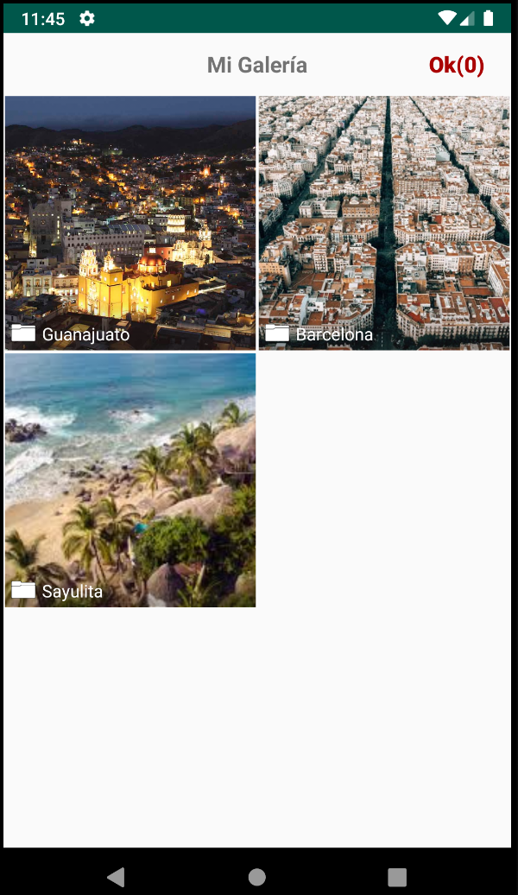

# The Gallery-Editor MVP App(Dagger version)
This is a public Android project that allows us to work with picture lists from the gallery and the edition of those pictures. This project contains the following two components:
- Gallery component: Allows to select one or multiple pictures from the different albums in the device gallery. The Gallery package contains all the MVP Gallery project.
- Editor component: Allows to sort the selected list of pictures using drag and drop, and also rotate, delete and crop every picture int the list. The Editor package contains all the MVP Editor project.

The MainActivity contains an example code for the Gallery and Editor project consumption.

      

## Used tools

* Dagger II
* Glide
* Butterknife
* Cropper - NoCropper - (https://github.com/jayrambhia/CropperNoCropper)
* MVP
* Mockito for Presenter testing

## Authors

* **Miguel Angel Ochoa** - (https://github.com/developmadd)

